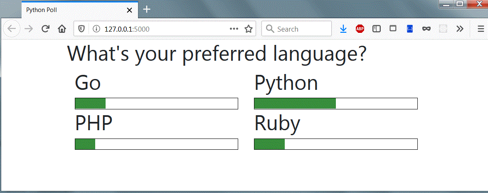
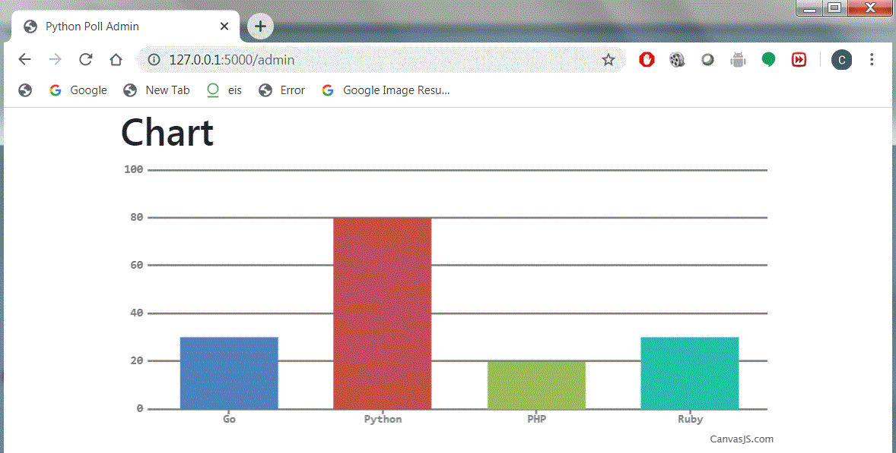

# python-poll-pusher

## Synopsis

This is a polling application which graphs the results of the poll in a bar graph.

I followed the tutorial to build the live polling app:
https://pusher.com/tutorials/live-poll-python

You can also clone project repository from github:
https://github.com/neoighodaro/python-realtime-poll-pusher

 <kbd></kbd>

 <kbd></kbd>

## Technologies

Pusher - Hosted APIs to build realtime apps

Flask - a microframework for Python based on Werkzeug and Jinja 2

Python with JavaScript and HTML

## Run the Application

Delete existing pycache file then execute the commands below:

$python dbsetup.py

$flask run

